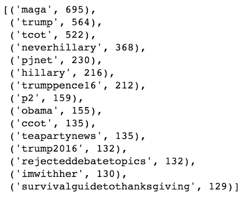

# Troll Tweet Classification

## Collaborators
@danjizquierdo https://github.com/danjizquierdo/

## Objective
The objective of this project is to detect whether a tweet was sent from an account tied to Russia's Internet Research Agency based purely on its text content. The scope of the project is looking at tweets specifically sent during the highest activity of these accounts discovered by the House Intelligence Committee investigation. These messages were compared against tweets during the same period related to the 2016 Presidential election. Samples were taken from the 'Candidates and key election hashtags' collection and their content was compared to that from the Kaggle set in order to verify that their topics were similar to justify comparison. The time frame was narrowed to those in common between the two sets.
https://docs.google.com/presentation/d/130uUKQWzOtLQHsPs3jaOCtVE6W7ONptiFkORpMLqe3M/edit?usp=sharing

## Data Sources:
* Non-Troll Tweets  
https://dataverse.harvard.edu/dataset.xhtml?persistentId=doi:10.7910/DVN/PDI7IN
These tweets were stored in a collection and rehydrated into jsonl files using Twarc. The chosen collection has several million tweets. For the scope of our project we chose to sample every 400th tweet from the collection based on our resources and time constraints. The ids for the samples we chose to rehydrate are located in the non-troll-tweets folder as txt files. 
* Troll Tweets  
https://www.kaggle.com/vikasg/russian-troll-tweets/
Identified in the dataset reconstructed by NBC News.

## Data Cleaning, Analysis and Model Evaluation
The process of cleaning, analyzing and creating the models based on this corpus is located in the TrollTweetClassification Jupyter Notebook. 

## Results
#### Comparability of Datasets
Exploratory data analysis verified that the tweets from both sources were comparable. The most common words in each set revealed overlap between the words but not necessarily the frequency or prominence of each word. These results are visualized in the following word clouds:
* Troll Tweets  

* Non-Troll Tweets  

A simple count was done for the prevalence of hashtags in each set. The similarity of the hashtags can be seen below as well as the disparity in count between each set.
* Non-Troll Tweets  

* Troll Tweets  

#### Final Model
TO-DO: Go through specifics of model selection and parameter choosing including undersampling

* Confusion Matrix  

* ROC Curve  

## Conclusions
Our final model created by stacking two separate Stochastic Gradient Descent Classifiers managed to identify 49-57% of Troll tweets while falsely flagging about 12-16% of regular tweets, depending on the chosen weight parameter. The AUC for the final model reached .77 for the unweighted case which was impressive given the few features fed into the model. Next steps for the project would include further analysis and treatment of the hashtags and mentions contained in the tweets as well as using more advanced Natural Language Processing tools like sentiment analysis and language detection. Based on our exploration in dealing with the class imbalance further improvements in the performance of the model are likely with oversampling instead of undersampling.
